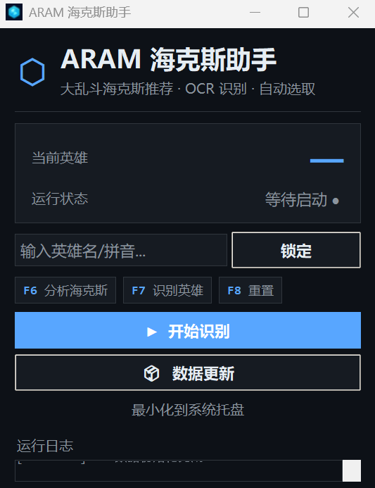
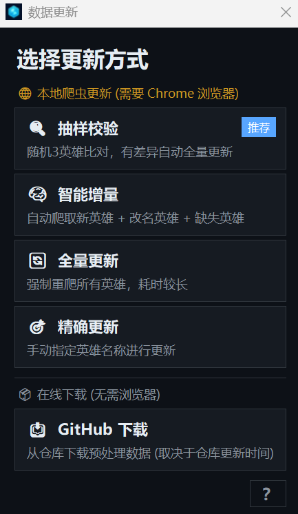

# LOL ARAM Mayhem Hextech Helper (大乱斗海克斯助手)


一个基于 **计算机视觉 (OCR)** 和 **大数据分析** 的英雄联盟极地大乱斗 (ARAM) 辅助工具。
它能自动识别游戏内的海克斯强化符文，并根据胜率数据提供最佳选择建议。

 <p align="center">
      
      <br>
      <em>图：海克斯识别与颜色提示效果展示（游戏内）</em>
    </p>

 <p align="center">
      
      
      <br>
      <em>图：全新可视化主界面与多样化数据更新选项</em>
    </p>

> **数据来源说明**: 本项目的数据抓取自 [OP.GG](https://op.gg/zh-cn/lol/modes/aram-mayhem)。本工具仅供学习交流使用。

---

## ⚠️ 核心前置条件 (Prerequisites)

1.  **管理员身份运行**: 程序涉及全局热键监听和截取客户端进程信息，**建议以管理员身份**运行解压后的 `ARAMHelper.exe`（开发者请以管理员权限运行 Python 或所在终端）。
2.  **游戏显示模式**: 必须设置为 **“无边框” (Borderless)**。
3.  **游戏进程状态**: **推荐先启动英雄联盟客户端并登录**，程序能够自动连接游戏本地服务 (LCU API) 以获取当前英雄。
4.  **屏幕分辨率**: 程序会根据主显示器分辨率**自动适配**（以 2K 为基准等比缩放），支持 1080p / 2K / 4K 等常见分辨率，无需手动配置。

---

## ✨ 功能特性 (Features)

*   **🛡️ 实时遮罩**: 在游戏界面上直接显示推荐结果，无需切屏。
*   **🔌 本地 API 联通**: 自动扫描并连接英雄联盟客户端 (LCU)，自动识别你在选人阶段摇到的英雄。
*   **👁️ 自动识别**: 使用 `RapidOCR` 毫秒级识别屏幕上的三个海克斯选项，本地部署零延迟。
*   **🤖 智能推荐**: 自动计算“白银/黄金/棱彩”海克斯的优先级（基于 OP.GG 等综合胜率算法）。
*   **🎹 极简交互**: 全程依托键盘快捷键 (`F6`, `F7`, `F8`) 完成闭环操作。
*   **🔄 数据自动维护 (全新面板)**: 
    *   自带四维进化爬虫：**抽样校验**（极速防呆）、**智能增量**（补充新英雄）、**全量更新**、**精确打击**（支持中英拼音模糊搜找单英雄修补）。
    *   内置 GitHub 静态库在线下载兜底，无缝拯救本地无 Chrome 和网络受限的玩家环境。

---

## 🛠️ 安装指南 (Installation)

1.  **克隆仓库**:
    ```bash
    git clone https://github.com/Nyx0ra/lol-aram-mayhem-hextech-helper.git
    cd lol-aram-mayhem-hextech-helper
    ```

2.  **安装依赖**:
    ```bash
    pip install -r requirements.txt
    ```

> [!NOTE]
> **关于客户端路径配置**：
> 绝大多数情况下程序能够通过 `psutil` 跨盘符自动扫描到你的游戏。但如果你启动后发现**无法自动识别英雄**，可能是由于权限受限，此时请打开 `scripts/lcu_connector.py`，并在文件开头的 `COMMON_INSTALL_PATHS` 列表中添加你的真实英雄联盟安装路径（例如：`r"E:\Game\英雄联盟"`）。

---

## 🚀 使用教程 (Usage)

本工具为不同需求的用户提供了两个版本的使用方式，请根据你的情况选择：

### 版本一：免安装直接运行版 (适合小白/绝大多数玩家)

不需要任何本地环境配置，直接下载即可：

1. **获取程序**：前往 [Releases 页面](https://github.com/Nyx0ra/lol-aram-mayhem-hextech-helper/releases) 下载最新版本的压缩包（例如 `ARAMHelper_vX.X.x.zip`）。
2. **解压及运行**：将其解压到任意目录，并**右键点击 `ARAMHelper.exe` 选择「以管理员身份运行」**。
3. **识别与游戏内操作**：
   * 启动程序后，若你已经在客户端选人界面，系统会自动利用 LCU API 识别你要玩的英雄并锁定。
   * 若发现自动识别未生效（可能是提前打开了程序或网络抽风），请先尝试在游戏内按下 **`F7`** 主动读取重新绑定当前英雄。
   * **备选方案（手动锁定）**：如果依然没连上，你也可以直接在界面输入框输入英雄**称号的首字母缩写**来秒猜锁定。例如输入 `txj`（探险家）、`jfjh`（疾风剑豪）、`xjch`（迅捷斥候）。
   * **`F6` - 识别并分析**: 遇到弹出海克斯强化的界面：按下键盘上的 **`F6`** 键，屏幕中央会生成一层超酷的悬浮遮罩！<br/>
     <span style="color:gold">**金色**</span>（最顶尖推荐）、<span style="color:green">**绿色**</span>（优质推荐）、<span style="color:red">**红色**</span>（查无数据/不推荐）。
   * **`F7` - 刷新英雄**: 游戏内按 **F7** 可以让系统强制悬浮显示当前正在跟踪的英雄名称。如果在选人界面自动检测失败或使用了骰子交换英雄，立刻按下此键能主动触发接口重新刷取本局英雄。
   * **`F8` - 内部重启 (极少使用)**: 将整个后台跟踪程序完全重置回刚双击打开时的状态并弹回主屏幕。一般情况下你直接用不到它，当你打完上一把或是骰子换人后，**下一局每次想要重置身份时只需要按 F7 即可刷新获取新英雄！**

*(注：如果你想要更新本程序的胜率数据库，只需在主界面点击“**数据更新**”。推荐直接使用“抽样校验”或者兜底的“Github下载”保持同频。)*

---

### 版本二：本地源码部署版 (适合开发者/极客使用)

如果你想自己参与研究并直接基于源码运行：

1. **准备环境**：请确保已依照上述“安装指南”克隆了代码仓库，并在本地配置好的 Python 环境内安装了 `requirements.txt`。
2. **启动程序**：右键点击你的 IDE终端或 CMD，选择 **“以管理员身份运行”**，执行全新的图形可视化客户端：
   ```bash
   python gui_launcher.py
   ```
3. **数据更新 (四维自动爬虫化)**：
    * 终端版内置了最前沿的爬虫代码。在主界面点击 **数据更新** 会呼出专用管理员面板：
      * **抽样校验 (推荐)**：随机抽取 3 名英雄进行云端数据比对，一旦发现版本落后自动触发批量升级！
      * **智能增量**：专门用于抓取新上线的英雄或发生改名的英雄。
      * **全量更新**：数据库清空时大更新专用。
      * **精确更新**：输入类似“ez”、“女警” 等简拼或者外号，后台将自动执行模糊匹配为你单抓一条数据。
      * 此外还有无浏览器的 **GitHub 本地下载兜底**供你救急调用。

---

## ⚙️ 高级配置 (分辨率适配)

程序启动时会自动检测主显示器分辨率，并以 2K (2560×1440) 坐标为基准进行等比缩放，**无需手动修改任何参数**。

> [!NOTE]
> 自动适配要求游戏以 **无边框窗口** 模式运行。若识别区域出现偏移，可检查上述设置。

---

## 📂 文件结构说明

* `main.py`: 主程序（GUI 遮罩、按键监听、程序逻辑）。
* `scripts/lcu_connector.py`: 英雄联盟本地 API 通信模块。
* `scripts/hero_scraper.py`: 爬虫脚本（基于 Selenium 抓取数据）。
* `scripts/updater.py`: 数据同步工具（手动触发更新、合并数据）。
* `data/hero_augments.csv`: 核心数据库。

## 📄 License

MIT License.
